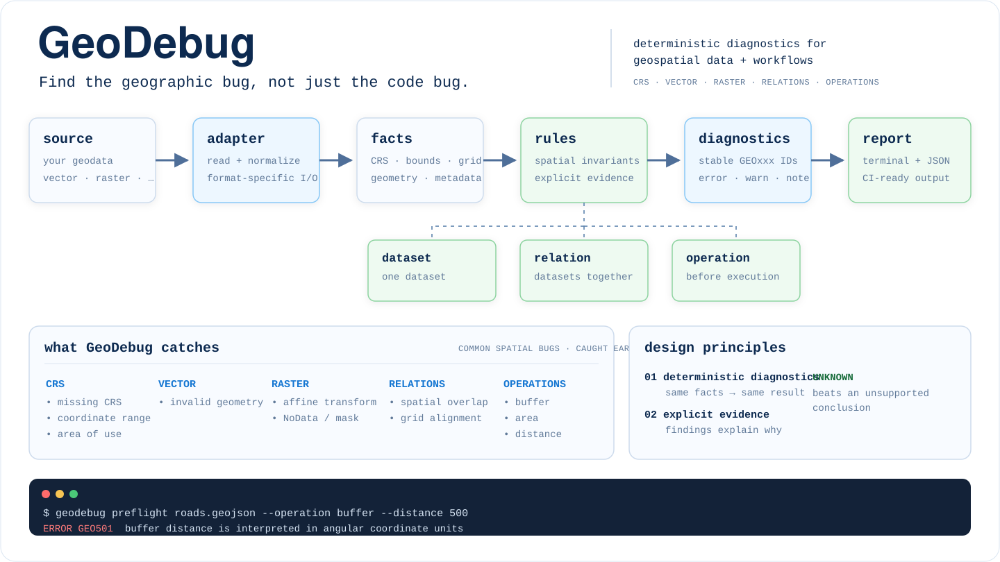

<div align="center">

# GeoDebug

**Find the geographic bug, not just the code bug.**

Deterministic diagnostics for geospatial data and workflows.

[](https://github.com/GeoGeekLab/geodebug/actions/workflows/ci.yml)
[](https://github.com/GeoGeekLab/geodebug/releases/latest)
[](LICENSE)
[](https://www.python.org/)
[](pyproject.toml)

[Architecture](docs/architecture.md) · [Rule catalog](docs/rules.md) · [Contributing](CONTRIBUTING.md) · [Security](SECURITY.md) · [Changelog](CHANGELOG.md) · [v0.1.0](https://github.com/GeoGeekLab/geodebug/releases/tag/v0.1.0)

</div>

---

GDAL can open it. Python can run it. A geometry can be valid.

**The workflow can still be geographically wrong.**

GeoDebug is a deterministic diagnostic engine for spatial correctness. It turns CRS semantics,
geometry state, raster grid structure, cross-dataset relationships, and operation context into
stable `GEOxxx` diagnostics with explicit evidence.

No LLM in the core. No silent CRS guessing. No automatic "fix everything."

<p align="center">
  
</p>

## What it catches

GeoDebug is built for bugs that ordinary syntax checks and file validators often miss.

| Domain | Examples |
| --- | --- |
| **CRS** | missing CRS, impossible angular coordinates, data outside a projected CRS area of use |
| **Vector** | invalid geometry |
| **Raster** | singular affine transforms, NoData/mask conflicts |
| **Relations** | non-overlapping datasets, half-pixel raster grid shifts |
| **Operations** | metric buffer, planar area, or planar distance on a geographic CRS |

A file can be valid in isolation and still be wrong **for the operation you are about to run**.
That distinction is the point.

## See it fail

```console
$ geodebug preflight roads.geojson --operation buffer --distance 500

roads.geojson
ERROR GEO501  Buffer distance is interpreted in angular coordinate units.
  crs.kind: geographic
  crs.axis_units: degree, degree
  operation.distance: 500
1 error(s) · 0 warning(s) · 0 note(s) · 1 unknown
```

The rule is not guessing from code text. GeoDebug inspects the dataset, normalizes spatial facts,
then evaluates the operation against those facts.

## Mental model

```text
source
  │
  ▼
adapter ──► facts ──► rules ──► diagnostics ──► report
                        ▲
                        │
              dataset / relation / operation
```

Three questions drive the engine:

1. **Dataset** — is this dataset internally spatially plausible?
2. **Relation** — are these datasets compatible with each other?
3. **Operation** — is this operation semantically valid for these coordinates and units?

Adapters observe. Rules diagnose. Policy filters presentation. Those boundaries are deliberate.

## CLI

| Command | Purpose |
| --- | --- |
| `geodebug inspect DATA` | Show normalized spatial facts without diagnosing |
| `geodebug check DATA` | Run dataset diagnostics |
| `geodebug compare A B` | Run dataset + relational diagnostics |
| `geodebug preflight DATA --operation ...` | Check operation semantics before execution |
| `geodebug rules list` | Inspect the built-in rule corpus |
| `geodebug schema` | Print the canonical report schema |

Full geometry or raster scans are opt-in:

```bash
geodebug check landcover.tif --deep
```

Machine-readable output is first-class:

```bash
geodebug check roads.geojson --format json
```

## Install

GeoDebug `0.1.0` is distributed from the GitHub release/tag. PyPI publication is not enabled yet.

```bash
pip install "geodebug @ git+https://github.com/GeoGeekLab/geodebug.git@v0.1.0"
```

For the full adapter set:

```bash
pip install "geodebug[all] @ git+https://github.com/GeoGeekLab/geodebug.git@v0.1.0"
```

Optional extras keep the core small:

| Extra | Support |
| --- | --- |
| core | GeoJSON |
| `vector` | GeoPackage, Shapefile, FlatGeobuf |
| `raster` | GeoTIFF, COG, VRT |
| `parquet` | GeoParquet |
| `geopandas` | in-memory GeoDataFrame |
| `all` | all optional adapters |

Requires Python **3.12+**.

## Diagnostic corpus

GeoDebug `0.1.0` ships 11 built-in rules with stable IDs.

| Family | Rules |
| --- | --- |
| CRS | [`GEO101`](docs/rules/GEO101.md) missing CRS · [`GEO103`](docs/rules/GEO103.md) coordinate range · [`GEO105`](docs/rules/GEO105.md) area of use |
| Vector | [`GEO201`](docs/rules/GEO201.md) invalid geometry |
| Raster | [`GEO301`](docs/rules/GEO301.md) affine transform · [`GEO304`](docs/rules/GEO304.md) NoData/mask conflict |
| Relations | [`GEO402`](docs/rules/GEO402.md) spatial overlap · [`GEO404`](docs/rules/GEO404.md) grid alignment |
| Operations | [`GEO501`](docs/rules/GEO501.md) buffer · [`GEO502`](docs/rules/GEO502.md) area · [`GEO503`](docs/rules/GEO503.md) distance/length |

Every released rule has an explicit contract for `PASS`, `FAIL`, `UNKNOWN`, and
`NOT_APPLICABLE`.

```bash
geodebug rules show GEO404
```

## Project policy

Projects can tune severity, disable rules, and suppress known exceptions without changing rule
truth values.

```toml
schema_version = "1"
profile = "default"
fail_on = "error"

[rules]
disable = []

[rules.severity]
GEO101 = "error"

[[suppress]]
rule = "GEO103"
path = "legacy/*.geojson"
reason = "Known upstream coordinate convention"
expires = 2027-01-01
```

GeoDebug searches the current directory and its parents for `.geodebug.toml`. Use `--config`
to select one explicitly.

Profiles are intentionally simple:

- `default` — rule defaults
- `strict` — warnings become errors
- `exploratory` — warnings become notes

Explicit overrides win. Suppressions require a reason and may expire.

## Contracts over vibes

A few things GeoDebug refuses to blur:

- **Adapters do not diagnose.** They normalize observations into facts.
- **Rules do not perform I/O.** They evaluate spatial invariants.
- **`UNKNOWN` is not `PASS`.** Missing evidence stays missing.
- **Policy does not rewrite truth.** It changes severity or visibility, not the rule result.
- **Expensive scans are explicit.** `--deep` means `--deep`.
- **Automatic repair is conservative.** A geometrically valid output is not necessarily a
  scientifically valid fix.

The canonical report schema is versioned independently at `1.0.0`; project config uses schema
version `1`.

```bash
geodebug schema
geodebug schema --kind config
```

## Development

```bash
git clone https://github.com/GeoGeekLab/geodebug.git
cd geodebug

python -m venv .venv
source .venv/bin/activate
pip install -e '.[dev,all]'

ruff check .
mypy src/geodebug
pytest
```

The release gate checks more than unit tests: four-state rule contracts, golden
`must_not_report` cases, metamorphic corrections, clean-corpus silence, cross-platform smoke
tests, and installation from a freshly built wheel.

See [Architecture](docs/architecture.md), [Diagnostic rules](docs/rules.md), and
[Releasing](docs/releasing.md) for the deeper contracts.

## Contributing

Contributions should start from a concrete geospatial failure mode or a clearly bounded
engineering improvement. New diagnostics must preserve the four-state rule contract and include
false-positive coverage where adjacent rules can cascade.

See [CONTRIBUTING.md](CONTRIBUTING.md).

## Security

Please report vulnerabilities privately through GitHub's security reporting features when
available. Do not publish exploit details in a public issue before a fix or mitigation is
available.

See [SECURITY.md](SECURITY.md).

## License

[MIT](LICENSE)

---

<div align="center">

**Geo to see. Geek to build.**

GeoGeekLab

</div>
