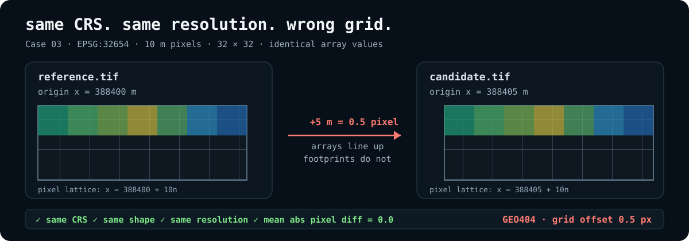

# 5 Geospatial Bugs That Valid Data and Passing Tests Won't Catch

A parser can tell you the file is readable.

Shapely can tell you a geometry is valid.

Pytest can tell you the code returned what the test expected.

None of those checks answer the question that breaks a lot of geospatial pipelines:

**Does this result make sense on the Earth?**

The five cases below are small on purpose. Each one reproduces a failure mode that shows up in
real GIS, remote-sensing, and spatial ETL work. The input opens. The code runs. The process exits
successfully. The geography is still wrong.

Every case is executable under
[`examples/geospatial-bugs/`](../examples/geospatial-bugs/).

```bash
pip install "geodebug[all]"
```

| Case | What passes | What is wrong | GeoDebug |
| --- | --- | --- | --- |
| 01 | buffer operation returns geometry | 500 is interpreted in degrees, not meters | `GEO501` |
| 02 | JSON parses and Point is valid | Web Mercator x/y were written as GeoJSON lon/lat | `GEO103` |
| 03 | same CRS, shape, resolution, and array values | raster grids are offset by half a pixel | `GEO404` |
| 04 | both files are valid and spatial join runs | the wrong regional partition was loaded | `GEO402` |
| 05 | raster opens and both validity conventions are legal | NoData and mask disagree about a pixel | `GEO304` |

The interesting bit is not that these inputs are malformed. They are not.

The interesting bit is that normal software checks can all be green while spatial semantics are
wrong.

## 1. The 500 m buffer that is not 500 meters

A road-closure feed arrives as GeoJSON around Tokyo Station. The downstream job needs a 500 m
impact zone.

The obvious code is:

```python
roads = gpd.read_file("road_segment.geojson")
buffers = roads.geometry.buffer(500)
```

GeoPandas warns when a buffer is run directly on a geographic CRS, but it still returns a
geometry. If warnings are not fatal in the job runner, the pipeline continues.

That matters because RFC 7946 GeoJSON coordinates are longitude/latitude. The number `500` is
therefore fed to the geometry engine in angular coordinate units. It is not a 500 m distance.

Run the case:

```bash
cd examples/geospatial-bugs/01-buffer-in-degrees
python make_case.py
python wrong.py
```

The bad workflow exits 0 and produces a polygon.

Preflight the operation instead:

```bash
geodebug preflight road_segment.geojson --operation buffer --distance 500
```

```text
ERROR GEO501  Buffer distance is interpreted in angular coordinate units.
```

The fix is not a different buffer function. The fix is to project into a suitable local
projected CRS before doing metric geometry.

Case:
[`01-buffer-in-degrees`](../examples/geospatial-bugs/01-buffer-in-degrees/)

References:
[RFC 7946 §4](https://www.rfc-editor.org/rfc/rfc7946.html#section-4) ·
[GeoPandas `GeoSeries.buffer`](https://geopandas.org/en/stable/docs/reference/api/geopandas.GeoSeries.buffer.html)

## 2. A perfectly valid Point in an impossible coordinate space

A database or tile-service workflow stores a location in EPSG:3857. Somewhere on the export
path, the raw projected x/y values get written directly into GeoJSON.

The fixture looks like this:

```json
{
  "type": "Point",
  "coordinates": [15558802.40, 4256843.19]
}
```

The JSON is valid.

Shapely is happy:

```text
geometry_type=Point
geometry_valid=True
```

The problem is not geometry validity. Those numbers are Web Mercator coordinates. A GeoJSON
consumer reads them as longitude/latitude.

The result is structurally clean and geographically impossible.

Run it:

```bash
cd examples/geospatial-bugs/02-web-mercator-as-geojson
python make_case.py
python wrong.py
geodebug check station.geojson
```

GeoDebug reports:

```text
ERROR GEO103  Geographic coordinates exceed plausible angular ranges.
```

This is the kind of bug that slips through when a pipeline validates schema and geometry but
never checks whether the declared coordinate model matches the numbers.

Case:
[`02-web-mercator-as-geojson`](../examples/geospatial-bugs/02-web-mercator-as-geojson/)

Reference:
[RFC 7946 §4](https://www.rfc-editor.org/rfc/rfc7946.html#section-4)

## 3. Same CRS. Same resolution. Wrong grid.

This one is nastier because nearly every quick metadata check passes.

Two raster exports are stacked for pixel-wise comparison:

```text
CRS          EPSG:32654
shape        32 × 32
resolution   10 m × 10 m
array values identical
```

The second raster starts 5 m farther east.

That is half a pixel.

<p align="center">
  
</p>

If the code drops straight to NumPy, the arrays line up by index:

```python
diff = np.abs(reference - candidate)
print(diff.mean())
```

Output:

```text
0.0
```

Numerically perfect.

Spatially wrong.

Run the full reproduction:

```bash
cd examples/geospatial-bugs/03-half-pixel-shift
python make_case.py
python wrong.py
```

It reports:

```text
same_crs=True
same_shape=True
same_resolution=True
same_transform=False
mean_abs_pixel_diff=0.0
```

Then compare the datasets:

```bash
geodebug compare reference.tif candidate.tif
```

```text
WARNING GEO404  Raster grids are not aligned to the same pixel lattice.
```

For pixel-wise math, CRS and resolution are not enough. The rasters need to occupy the same
pixel lattice. If they do not, align or resample explicitly before comparing cells.

This is why the affine transform is not incidental metadata. It is part of the data model.

Case:
[`03-half-pixel-shift`](../examples/geospatial-bugs/03-half-pixel-shift/)

Reference:
[Rasterio transforms](https://rasterio.readthedocs.io/en/stable/api/rasterio.transform.html)

## 4. The empty spatial join was the wrong partition

A scheduled job expects detections for Tokyo.

The object-store path resolves successfully. The file schema is correct. The data is valid
GeoJSON. The spatial join runs without an exception.

The job prints:

```text
detections_in=3
joined_rows=0
pipeline_status=success
```

That can easily be interpreted as a valid business result:

> no detections inside the AOI today

But the loaded partition contains Sapporo detections.

Nothing is wrong with either dataset in isolation. The failure exists between them.

Run it:

```bash
cd examples/geospatial-bugs/04-wrong-region-partition
python make_case.py
python wrong.py
geodebug compare aoi_tokyo.geojson detections_sapporo.geojson
```

GeoDebug reports:

```text
ERROR GEO402  Dataset extents do not overlap.
```

The correct fix is upstream. Load the partition that belongs to the AOI.

Reprojection will not make Tokyo overlap Sapporo. Buffering the data until it overlaps would
only turn a routing bug into a data-quality bug.

Case:
[`04-wrong-region-partition`](../examples/geospatial-bugs/04-wrong-region-partition/)

## 5. One pixel, two answers: valid and NoData

Raster validity has more than one representation.

A common pipeline starts with `nodata=0`, then later writes a GDAL-style valid-data mask. Those
two mechanisms can disagree.

The case contains one zero-valued pixel:

```text
pixel value = 0
nodata      = 0
mask        = 255
```

Read by NoData value:

```text
valid_by_nodata=15
```

Read by mask:

```text
valid_by_mask=16
```

Both code paths are legitimate. They just disagree about which pixels belong in the analysis.

Run it:

```bash
cd examples/geospatial-bugs/05-nodata-mask-conflict
python make_case.py
python wrong.py
geodebug check surface_class.tif --deep
```

GeoDebug reports:

```text
WARNING GEO304  NoData-valued pixels are marked valid by the dataset mask.
```

This is especially easy to miss with 8-bit rasters, where a legitimate low value can be
quantized to zero while zero is also being used as the NoData sentinel.

Pick one validity model for the dataset and make the mask/metadata agree.

Case:
[`05-nodata-mask-conflict`](../examples/geospatial-bugs/05-nodata-mask-conflict/)

Reference:
[Rasterio masks](https://rasterio.readthedocs.io/en/latest/topics/masks.html)

## What these failures have in common

None of them are syntax errors.

None require a corrupted file.

None depend on an exotic GIS format.

They fail because the software has enough information to run, but not enough checks to reject a
spatially nonsensical operation or relationship.

That is the gap GeoDebug targets:

```text
file opens
geometry valid
tests green
pipeline exits 0

               ↓

spatial semantics still wrong
```

GeoDebug keeps the checks deterministic and rule-based:

```bash
geodebug check DATA
geodebug compare A B
geodebug preflight DATA --operation ...
```

Or run the built-in zero-setup example:

```bash
pip install geodebug
geodebug demo
```

The five reproductions in this article are also exercised in GeoDebug's integration CI. If a
future engine change stops catching one of them, the build fails.

Source:
[`examples/geospatial-bugs/`](../examples/geospatial-bugs/)
